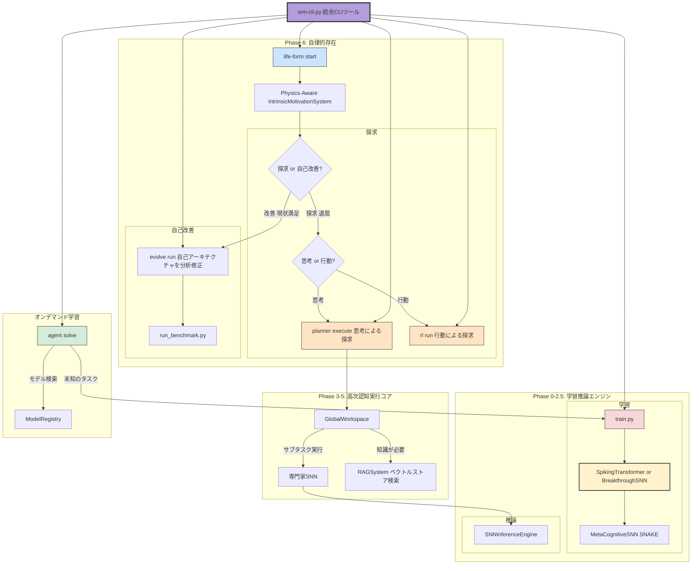

# **Project SNN: A Predictive Digital Life Form (v4.1)**

## **1. 概要**

本プロジェクトは、スパイキングニューラルネットワーク（SNN）技術を基盤とし、**自律的デジタル生命体 (Autonomous Digital Life Form)** の創造を目指す研究開発フレームワークです。

最終目標は、静的なパターン認識の限界を超え、世界の動的なモデルを内的に構築し、**未来を予測し、その予測誤差を最小化する**という自己の存在理由（自由エネルギー原理）に基づき、自律的に思考し、学習し、自己を改良するAIを実現することです。

このシステムは、単なるチャットボットではなく、以下の高度な認知能力を備えた自律エージェントとして動作します。

* **デュアルコアSNNアーキテクチャ:** 脳の働きに着想を得た**予測符号化モデル**に加え、時間情報処理能力を最大化する**スパイキングトランスフォーマー**という、2つの最先端アーキテクチャをタスクに応じて切り替え可能です。
* **オンデマンド学習:** 未知のタスクに直面した際、大規模言語モデルから知識を蒸留し、タスクに特化した超省エネルギーな「専門家SNN」を自律的に生成します。
* **自己認識と計画立案:** 自身の能力（学習済み専門家モデル）を把握し、**学習済みのプランナーSNN**を用いて、複雑なタスクをサブタスクに分解し、最適な実行計画を動的に推論します。
* **アーキテクチャレベルの自己進化:** 自らの性能を評価し、表現力不足と判断した場合、自身のソースコード（**モデルの層数や次元数**）を自律的に修正し、より強力なアーキテクチャへと進化します。
* **物理法則を考慮した好奇心:** 予測が上達することに加え、自身の内部状態が**物理法則（エネルギー効率や滑らかさ）**に合致すること自体を「報酬」と感じる、より高度な内発的動機付けを持ちます。
* **行動を通じた学習（強化学習）:** 従来の思考（推論）による問題解決だけでなく、バックプロパゲーションを一切使わない生物学的な学習則（報酬変調型STDP）を用い、環境との**試行錯誤**から直接スキルを学習する能力を持ちます。

## **2. システムアーキテクチャ**

本システムの認知アーキテクチャは、複数の専門コンポーネントが階層的に連携することで実現されています。

## **3\. システムの実行方法**

### **ステップ1: 環境設定**

まず、必要なPythonライブラリをインストールします。

pip install \-r requirements.txt

### **ステップ2: 統合CLIツール snn-cli.py の使い方**

本プロジェクトの全ての機能は、snn-cli.py という単一のコマンドから実行できます。-h または \--help を付けて実行すると、利用可能な機能の一覧が表示されます。

python snn-cli.py \--help

#### **A) デジタル生命体の自律ループを開始する**

AIの自律的な思考と学習のループを開始します。AIは自身の「好奇心」レベルに基づき、新たな探求を行ったり、自己の性能改善を試みたりします。

\# 10回の「意識サイクル」を実行  
python snn-cli.py life-form start \--cycles 10

#### **B) 複雑なタスクをプランナーに依頼する**

「要約」と「感情分析」を組み合わせたような、複数のステップが必要なタスクを実行させます。

python snn-cli.py planner execute \\  
    \--request "この記事を要約して、その内容の感情を分析してください。" \\  
    \--context "SNNは非常にエネルギー効率が高いことで知られているが、その性能はまだANNに及ばない点もある。"

#### **C) 単一のタスクをエージェントに依頼する**

「感情分析」のような単一のタスクを実行します。もし適切なモデルが存在しない場合、エージェントは自動的に新しいモデルの学習を開始します。

\# 学習済みの感情分析モデルで推論を実行  
python snn-cli.py agent solve \\  
    \--task "感情分析" \\  
    \--prompt "この映画は本当に素晴らしかった！"

\# "文章要約"モデルを新規に学習させ、その後推論を実行  
python snn-cli.py agent solve \\  
    \--task "文章要約" \\  
    \--unlabeled\_data\_path data/sample\_data.jsonl \\  
    \--prompt "SNNは、生物の神経系における情報の伝達と処理のメカニズムを模倣したニューラルネットワークの一種である。"

#### **D) アーキテクチャレベルの自己進化を試す**

意図的に低い初期精度を与えることで、エージェントにモデルの表現力不足を認識させ、アーキテクチャ（d\_modelなど）を自律的に強化させます。

\# 精度0.4という厳しい状況を与え、smallモデルのアーキテクチャ改善を促す  
python snn-cli.py evolve run \\  
    \--task\_description "高難度タスク" \\  
    \--initial\_accuracy 0.4 \\  
    \--model\_config "configs/models/small.yaml"

#### **E) 新しいSpiking Transformerアーキテクチャで学習する**

large.yamlで定義された新しいSpikingTransformerアーキテクチャでモデルを手動で学習させます。train サブコマンドの後ろには、train.py に渡す引数をそのまま記述します。

python snn-cli.py train \\  
    \--model\_config configs/models/large.yaml \\  
    \--data\_path data/sample\_data.jsonl \\  
    \--override\_config "training.paradigm=gradient\_based" \\  
    \--override\_config "training.gradient\_based.type=standard"

#### **F) 対話UIを起動する**

学習済みの専門家モデルとチャット形式で対話するためのWeb UIを起動します。

\# small.yamlで指定されたモデル（デフォルト）と対話  
python app/main.py

\# medium.yamlで指定されたモデルと対話  
python app/main.py \--model\_config configs/models/medium.yaml

## **4\. プロジェクト構造**

snn3/  
├── app/ \# UIアプリケーションとDIコンテナ  
├── configs/ \# 設定ファイル (base, models/.yaml)  
├── doc/ \# ドキュメント  
├── scripts/ \# データ準備やベンチマークなどの補助スクリプト  
├── snn\_research/ \# SNNコア研究開発コード  
│ ├── agent/ \# 各種エージェント (自律、自己進化、生命体、強化学習)  
│ ├── cognitive\_architecture/ \# 高次認知機能 (プランナー、物理評価器等)  
│ ├── core/ \# SNNモデル (BreakthroughSNN, SpikingTransformer)  
│ ├── learning\_rules/ \# 生物学的学習則 (STDPなど)  
│ ├── rl\_env/ \# 強化学習環境  
│ └── training/ \# Trainerと損失関数  
├── snn-cli.py \# ✨ 新規: 統合CLIツール  
├── train.py \# 勾配ベース学習の実行スクリプト (CLIから呼び出される)  
└── ... (その他のrun\_.pyスクリプトは内部的に利用、または将来的に廃止)
