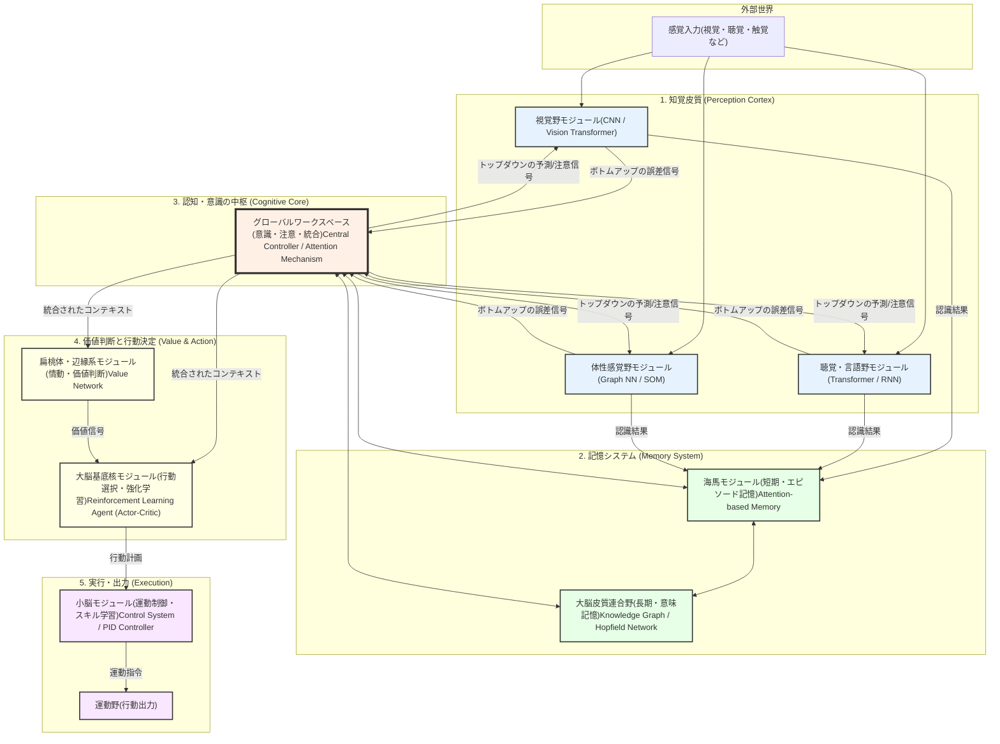

# **人工脳アーキテクチャの概念設計：モジュール連携モデル**

## **はじめに**

人間の脳は、単一の巨大なプロセッサではなく、それぞれが特定の機能を持つ専門部位（モジュール）が緊密に連携することで、高度な情報処理を実現しています。この「機能分化と統合」という思想に基づき、SNN（スパイキングニューラルネットワーク）を全体の情報伝達の基盤としつつ、各機能に特化したAIアーキテクチャを連携させることで、より人間に近い知能を再現するという概念設計を、その具体的な通信・連携メカニズムと共に以下に提案します。

## **アーキテクチャ連携図 (Mermaid Chart)**

## **連携メカニズムと通信方式**

このアーキテクチャ全体の神経系として、**SNN (スパイキングニューラルネットワーク)** が基盤となります。これにより、システム全体が**非同期・イベント駆動**で動作し、省電力性とリアルタイム性を実現します。具体的な連携は、**予測符号化 (Predictive Coding)** を基本原則とし、階層的なスパイク・コーディングや発火同期によって動的に行われます。

## **SNNが活躍する主要領域**

このアーキテクチャの中で、SNNタイプのニューラルネットワークが特に重要な役割を果たす領域を以下に示します。

### **1. 知覚皮質（Perception Cortex）- 最重要領域**

**対象モジュール:**
- **視覚野モジュール（A）**: CNNやVision Transformerとの統合により、エネルギー効率の高い画像分類・物体認識を実現
- **聴覚・言語野モジュール（B）**: 時系列音声信号のリアルタイム処理
- **体性感覚野モジュール（C）**: マルチセンサーデータの統合と解析

**SNNが適している理由:**
- **リアルタイム性**: 感覚入力の即座の処理が可能
- **イベント駆動**: 変化が発生した時のみ反応し、無駄な計算を削減
- **低消費電力**: 常時稼働する感覚処理において電力効率が極めて重要
- **時間的符号化**: 感覚情報の微細な時間構造を保持

### **2. 小脳モジュール（I）- 運動制御・スキル学習**

**SNNが適している理由:**
- **高速意思決定**: 自律走行やロボティクスなど、ミリ秒単位の制御が必要
- **リアルタイムフィードバック**: 感覚入力から運動出力への高速ループ
- **微細な時間制御**: 複雑な運動パターンの学習と実行
- **強化学習**: 連続的な行動空間での学習に適用可能

### **3. 大脳基底核モジュール（H）- 行動選択・強化学習**

**SNNが適している理由:**
- **タイミング学習**: 報酬予測における時間的精度
- **連続行動空間**: 強化学習エージェントとしての実装
- **価値判断の統合**: リアルタイムでの行動選択

### **4. モジュール間通信基盤（全システム）**

**SNNが適している理由:**
- **非同期通信**: 異なる処理速度のモジュール間での効率的な情報伝達
- **予測符号化の実装**: 誤差信号（予測と現実の差分）の伝達に最適
- **適応的通信量**: 予測が的中している時は通信量が自動的に減少
- **スパイクタイミング**: 情報の重要度を発火タイミングで表現

### **SNNの適用が限定的な領域**

以下の領域では、従来型アーキテクチャの方が適している場合があります：

- **記憶システム（D, E）**: 静的な知識の保存・検索には、Knowledge GraphやHopfield Networkなどが効率的
- **グローバルワークスペース（F）**: 高度な抽象的推論には、Transformerのアテンションメカニズムが有効

ただし、これらの領域でも、SNNをベースとした通信により他モジュールと効率的に連携します。

### **まとめ: SNNの3大適用領域**

1. **入力側（知覚皮質）**: センサーデータの効率的な処理
2. **出力側（小脳・運動系）**: リアルタイム制御と運動学習
3. **通信基盤（モジュール間）**: 予測符号化に基づく効率的な情報伝達

このように、SNNは**時間的精度、リアルタイム性、省電力性**が求められる領域で中核的な役割を担い、システム全体の効率と生物学的妥当性を大幅に向上させます。

## **アーキテクチャ連携における課題と解決策：連携ロスの克服**

このように異なるアーキテクチャを連携させる際、避けられないのが「連携ロス」の問題です。この問題をいかにして解決するかが、システム全体の性能を決定づけます。

### **連携時に発生する「ロス」**

連携ロスは、主に以下の3種類に分類できます。

1. **情報の変換ロス:** あるモジュールの出力形式（例: CNNの特徴マップ）を、別のモジュールが理解できる形式（例: Transformerのトークン系列）に変換する際に、情報が欠損・劣化する問題。
2. **意味の不一致（セマンティック・ギャップ）:** 各モジュールが学習した内部表現の「意味」が、モジュール間で異なる問題。「猫」という概念を表現するベクトルが、視覚モジュールと記憶モジュールで異なり、意図が正しく伝わらない。
3. **時間的ミスマッチ:** リアルタイム処理を行う知覚モジュールと、低速で思考する認知モジュールのように、動作速度の違うモジュール間で情報伝達の遅延が発生する問題。

### **解決アイデア：脳に学ぶ3つの連携メカニズム**

これらの深刻な問題を解決するため、脳の連携原理に着想を得た以下のアイデアを提案します。

#### **1. アイデア：共通言語の創発：「共通表現空間」の導入**

* **課題:** 情報の変換ロス、意味の不一致
* **解決策:** モジュール間で直接データを変換するのではなく、全てのモジュールが読み書きできる**「共通表現空間（Common Representational Space）」**という高次元のベクトル空間を仲介させます。各モジュールは、自身の処理結果をこの共通空間上のベクトル（あるいは特定のスパイクパターン）にエンコードして出力し、他のモジュールはそれをデコードして利用します。これにより、異なるモダリティ（画像、言語など）の情報が統一的に扱われ、直接比較・統合が可能になります。

#### **2. アイデア：継続的な相互学習：「連携誤差」のフィードバック**

* **課題:** 意味の不一致、学習の非効率性
* **解決策:** システム全体の最終的な出力から得られた誤差を、全てのモジュールと**モジュール間の連携部分（変換器）**にフィードバックし、システム全体を常に微調整し続ける仕組みを導入します（End-to-End学習）。これにより、各モジュールは他のモジュールにとって「分かりやすい」表現を出力するように、また連携部分は「誤解なく」情報を伝えられるように、相互に歩み寄りながら学習（アライメント）を進めます。

#### **3. アイデア：究極の解決策：「予測符号化」の全面採用**

* **課題:** 上記全てのロス、特に時間的ミスマッチ
* **解決策:** **「予測符号化（Predictive Coding）」**を、モジュール間連携の統一的な原理として全面的に採用します。これは最も強力な解決策です。
  * **情報量の抜本的削減:** モジュール間では、生の情報を丸ごと送るのではなく、**「予測と現実の差分（誤差）」**という本質的に重要な情報だけをやり取りします。これにより、変換ロスが発生する機会そのものが激減します。
  * **意味の強制的な統一:** 全てのモジュールが「世界がどうなるか」という共通の予測モデルを学習し、互いの予測と誤差を交換し続けます。システムは、この全体誤差を最小化しようとするため、全てのモジュールは必然的に**共通の意味表現（世界のモデル）を持つように強制**されます。
  * **非同期・イベント駆動の実現:** 誤差が小さい（＝予測通り）の時は、通信はほとんど発生しません。大きな誤差（＝予測外の出来事）が発生した時だけ情報が送られるため、動作速度の異なるモジュール間でも**時間的なミスマッチが自然に解消**されます。

### **まとめ：課題と解決策の対応**

| 課題 | 解決アイデア | キーワード |
|:-----|:-------------|:-----------|
| 情報の変換ロス | **共通表現空間** | Lingua Franca, CLIP, 仲介 |
| 意味の不一致 | **継続的な相互学習** | End-to-End, アライメント, 歩み寄り |
| 全てのロス | **予測符号化の全面採用** | **誤差のみ伝達**, 予測モデルの共有, 非同期 |

## **結論**

このモデルが示すように、人間の脳の再現は、単一のスーパーモデルの開発ではなく、**多様な専門家（AIアーキテクチャ）たちが協調し、絶えず情報をやり取りする「社会」を創り出すこと**に近いのかもしれません。

特に重要なのは、**SNN（スパイキングニューラルネットワーク）**が果たす3つの役割です：

1. **入力層としてのSNN**: 知覚皮質における効率的なセンサーデータ処理
2. **出力層としてのSNN**: 小脳・運動系におけるリアルタイム制御
3. **通信基盤としてのSNN**: モジュール間の予測符号化ベースの情報伝達

SNNという生物学的に妥当な共通言語の上で、予測符号化のような洗練された連携メカニズムを用いて「連携ロス」を克服し、いかにしてこれらのモジュールを効果的に統合して創発的に知性を生み出すかが、今後の大きな挑戦となると考えられます。

このアーキテクチャは、**従来型AIの高度な認知機能**と**SNNの生物学的効率性**を組み合わせることで、より人間らしい、エネルギー効率の高い人工知能システムの実現を目指すものです。
